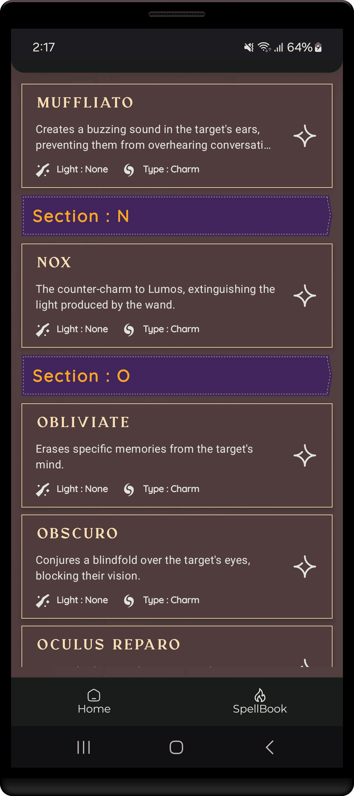

<h1 align="center" >  
Harry's SpellBook    ♨ [ ᴀɴᴅʀᴏɪᴅ  ᴘʀᴏᴊᴇᴄᴛ ] ♨
</h1>

## ɪ  ⁃  ᴘʀᴏᴊᴇᴄᴛ ɪɴꜰᴏ

> [!Note]
> **This project is still in its early development stage.**
#

An Android app that brings Harry Potter's magic to life with voice-activated spells like 'Lumos' to control your phone’s features.

 

 
 

