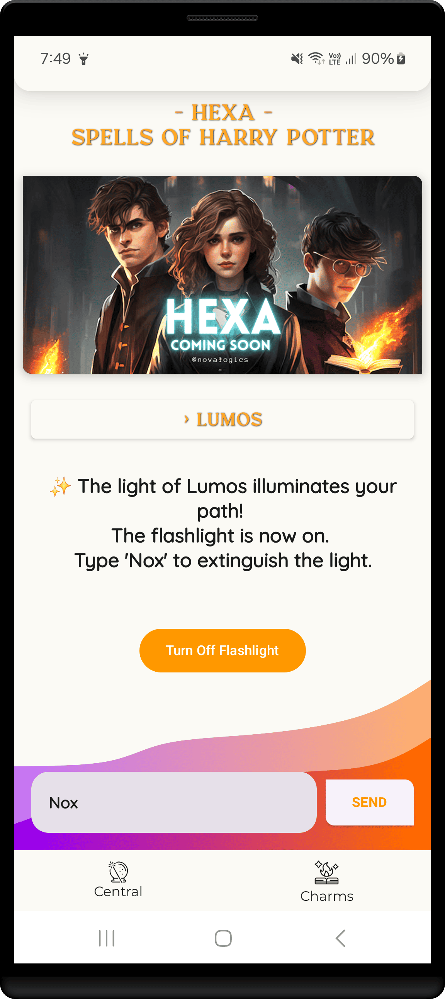
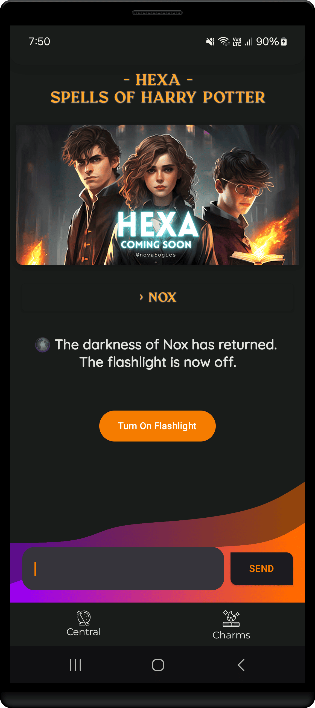
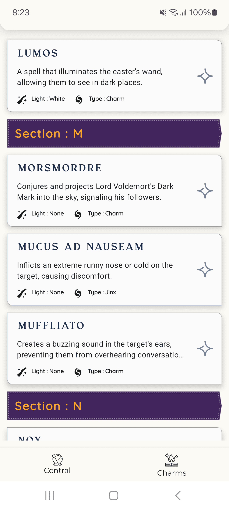
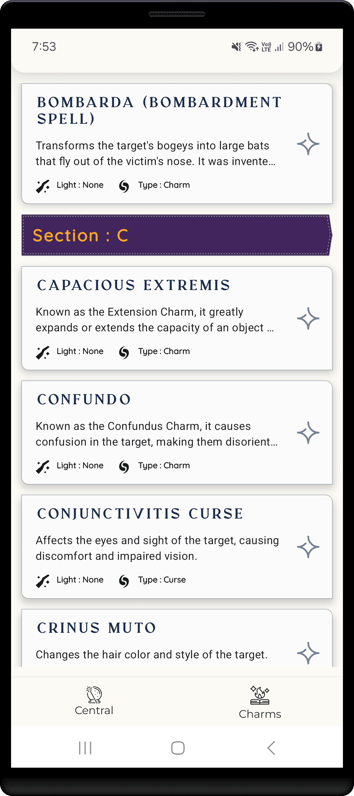
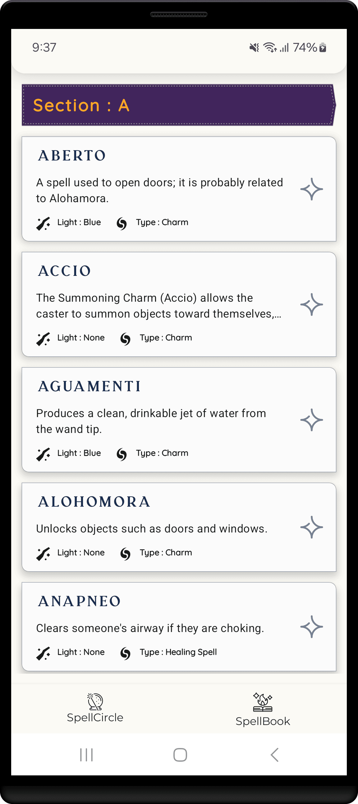

<h1 align="center" >  
HEXA    ♨ [ ᴀɴᴅʀᴏɪᴅ  ᴘʀᴏᴊᴇᴄᴛ ] ♨
</h1>

## ɪ  ⁃  ᴘʀᴏᴊᴇᴄᴛ ɪɴꜰᴏ

> [!Note]
> **This project is still in its early development stage.**
#

An Android app that brings Harry Potter's magic to life with voice-activated spells like 'Lumos' to control your phone’s features.

 

 
 

 

##  ᴠɪꜱᴜᴀʟ ᴛᴏᴜʀ ᴏꜰ ᴛʜᴇ ᴀᴘᴘ: ꜱᴄʀᴇᴇɴꜱ

#

   
