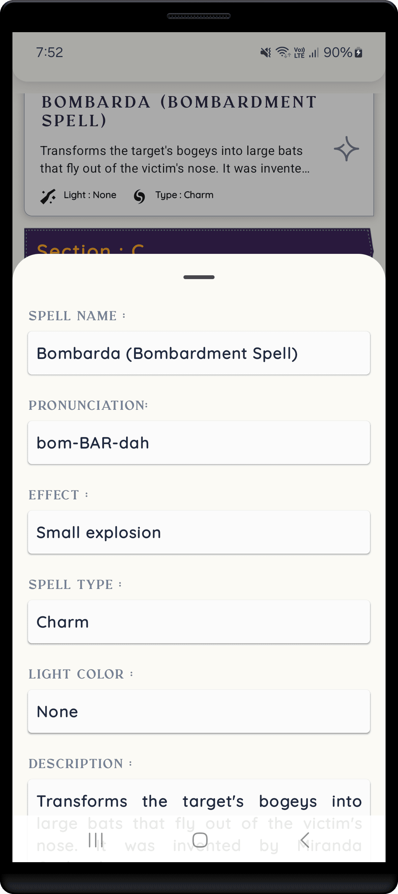
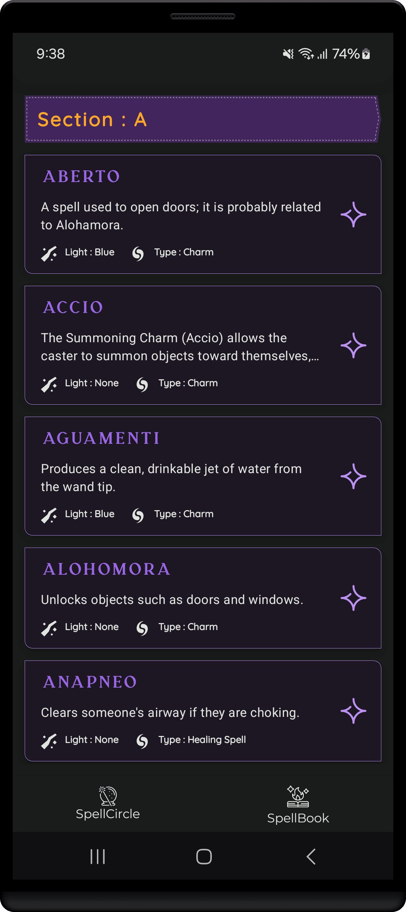

<h1 align="center" >  
HEXA    ♨ [ ᴀɴᴅʀᴏɪᴅ  ᴘʀᴏᴊᴇᴄᴛ ] ♨
</h1>

## ɪ  ⁃  ᴘʀᴏᴊᴇᴄᴛ ɪɴꜰᴏ

> [!Note]
> **This project is still in its early development stage.**
#

An Android app that brings Harry Potter's magic to life with voice-activated spells like 'Lumos' to control your phone’s features.

 

⁃ ᴄᴏɴᴛᴇɴᴛꜱ ⁃  
[ᴜꜱᴇʀ ꜰᴇᴀᴛᴜʀᴇꜱ](#ɪɪ--ᴡʜᴀᴛ-ᴜꜱᴇʀꜱ-ᴄᴀɴ-ᴇxᴘᴇᴄᴛ)
| [ᴀᴘᴘ ꜱᴄʀᴇᴇɴꜱ](#ɪɪɪ--ᴠɪꜱᴜᴀʟ-ᴛᴏᴜʀ-ᴏꜰ-ᴛʜᴇ-ᴀᴘᴘ-ꜱᴄʀᴇᴇɴꜱ)
| [ᴘʀᴏᴊᴇᴄᴛ ʙʀᴀɴᴄʜᴇꜱ](#ɪᴠ--ᴘʀᴏᴊᴇᴄᴛ-ʙʀᴀɴᴄʜᴇꜱ)
| [ᴅᴇᴠ ꜰᴇᴀᴛᴜʀᴇꜱ](#ᴠ--ʙᴇʜɪɴᴅ-ᴛʜᴇ-ᴄᴏᴅᴇ-ᴅᴇᴠ-ꜰᴇᴀᴛᴜʀᴇꜱ)
| [ᴘʀᴏᴊᴇᴄᴛ ɴᴏᴛᴇꜱ](#ᴠɪ--ᴘʀᴏᴊᴇᴄᴛ-ɴᴏᴛᴇꜱ)

 
 

 
 

 

## ɪɪ ⁃ ᴡʜᴀᴛ ᴜꜱᴇʀꜱ ᴄᴀɴ ᴇxᴘᴇᴄᴛ

### ⭓ Features

- **Magic Spell Control**: Use simple spells like "Lumos" to turn on the flashlight by typing or speaking.
- **Spell Guide**: Find and learn about popular spells from the Harry Potter world.
- **Dark and Light Mode**: Choose between light and dark themes for your comfort.
- **Offline Chatbot**: Chat with a bot anytime, even without internet.
- **Easy Navigation**: Simple and smooth design for a better experience.

##
### ⭓ Requirements
- Android 7.0 and Above
- Min SDK version 24

##
### ⭓ Permissions
- Internet
- Flashlight

## ɪɪɪ ⁃ ᴠɪꜱᴜᴀʟ ᴛᴏᴜʀ ᴏꜰ ᴛʜᴇ ᴀᴘᴘ: ꜱᴄʀᴇᴇɴꜱ

#

   

<kbd>[&nbsp; ⮝ &nbsp;  BACK TO TOP  &nbsp;&nbsp;&nbsp;](#ɪ--ᴘʀᴏᴊᴇᴄᴛ-ɪɴꜰᴏ) </kbd>

#
## ɪᴠ ⁃ ᴘʀᴏᴊᴇᴄᴛ ʙʀᴀɴᴄʜᴇꜱ

<!-- Main / Master / Production Branch -->

> <samp> **PRODUCTION BRANCH :**  </samp>  
> Stable code for deployment  
> ➲ [main][branch-main]

> <samp> **STAGING BRANCH :**  </samp>  
> `FLOW | Staging → Production`  
> For pre-release testing, which ensures that the code is stable, bug-free, and ready for deployment.  

> <samp> **DEVELOPMENT BRANCH :**  </samp>  
> `FLOW | Development → Release → Staging → Production`  
> Active codebase for ongoing development efforts  (New features, bug fixes, and improvements..)  
> ➲ [development][branch-development]

> <samp> **FEATURE BRANCHES :** N/A  </samp>  
> `FLOW | Feature → Development → Release → Staging → Production`  
<!-- 
> <samp> **FEATURE BRANCHES :**  </samp>  
> For Isolated feature development (Ensures changes are tested and reviewed before merging into the main workflow)  
>   
> feature/  
> ➲ dark-theme  
> ➲ offline-db-impl
-->

> <samp> **RELEASE BRANCHES :** N/A  </samp>  
> `FLOW | Release → Staging → Production`  
<!-- 
> <samp> **RELEASE BRANCHES :**  </samp>  
> Prepares the code for final testing and deployment in a new version release.
>   
> release/  
> ➲ version-number
-->

> <samp> **HOTFIX BRANCHES :** N/A  </samp>  
> `FLOW | Hotfix → Staging → Production`  
<!-- 
> <samp> **HOTFIX BRANCHES :**  </samp>  
> Handles critical fixes in production that need immediate resolution.
>   
> hotfix/  
> ➲ main-screen-crash 
-->

> <samp> **BUGFIX BRANCHES :** N/A  </samp>  
> `FLOW | Bugfix → Development → Release → Staging → Production` 
<!-- 
> <samp> **BUGFIX BRANCHES :**  </samp>  
> Addresses specific bugs identified during development and testing.
>   
> bugfix/  
> ➲ main-screen-error
-->

<!-- 
> <samp> **EXPERIMENTAL BRANCHES :** N/A  </samp>  

> <samp> **EXPERIMENTAL BRANCHES :**  </samp>  
> Facilitates trial and error to test new ideas and concepts.
>   
> experiment/  
> ➲ main-screen-change-colours
-->
<!-- Experimental → Feature → Development → Release → Staging → Main/Production   -->

[branch-main]:  https://github.com/NovaLogics/hexa-harry-potter-android-app/tree/main
[branch-development]:  https://github.com/NovaLogics/hexa-harry-potter-android-app/tree/development
[branch-staging]:  https://github.com/NovaLogics/hexa-harry-potter-android-app/tree/staging

[branch-feature-NAME]:  https://github.com/NovaLogics/hexa-harry-potter-android-app/tree/staging

[branch-hotfix-NAME]:  https://github.com/NovaLogics/hexa-harry-potter-android-app/tree/staging

[branch-bugfix-NAME]:  https://github.com/NovaLogics/hexa-harry-potter-android-app/tree/staging

   

#
## ᴠ ⁃ ʙᴇʜɪɴᴅ ᴛʜᴇ ᴄᴏᴅᴇ: ᴅᴇᴠ ꜰᴇᴀᴛᴜʀᴇꜱ

### ⭓ App Dependencies/Libraries Overview

 

* [Kotlin][0] : Kotlin is statically typed & first-class language for Android Development.
* [Coroutines][1] : For Asynchronus or non-blocking operations.
* [Flows][2] : Data Streaming API which is built on top of Coroutines.
* [Jetpack Compose][3] : Toolkit for building native UI in a declarative way.
* [Room][4] : Save data in a local database using Room
* [Retrofit][5] : Type-safe REST client for Android to consume RESTful web services.
* [Dagger Hilt][6] : Dependency injection library for Android.
* [Kotlin DSL][7] : For writing gradle script for Kotlin is more readable and offers better compile-time.

[0]:  https://kotlinlang.org/
[1]:  https://kotlinlang.org/docs/coroutines-overview.html
[2]:  https://developer.android.com/kotlin/flow
[3]:  https://developer.android.com/jetpack/compose
[4]:  https://developer.android.com/training/data-storage/room
[5]:  https://github.com/square/retrofit
[6]:  https://dagger.dev/hilt/
[7]:  https://docs.gradle.org/current/userguide/kotlin_dsl.html

#
### ⭓ Features

1. Development process info &nbsp;|&nbsp;  [ More-> ](#1-project-log)

#

<kbd>[&nbsp; ⮝ &nbsp;  BACK TO TOP  &nbsp;&nbsp;&nbsp;](#ɪ--ᴘʀᴏᴊᴇᴄᴛ-ɪɴꜰᴏ) </kbd>

